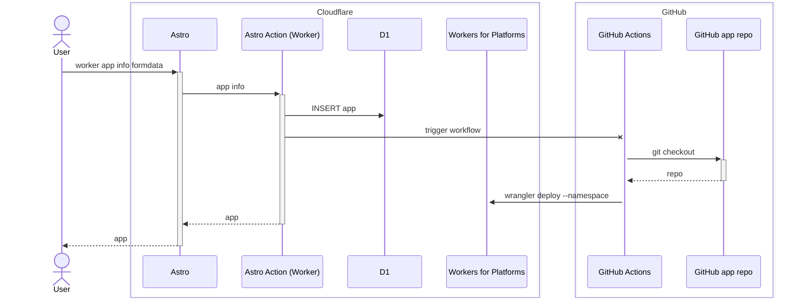
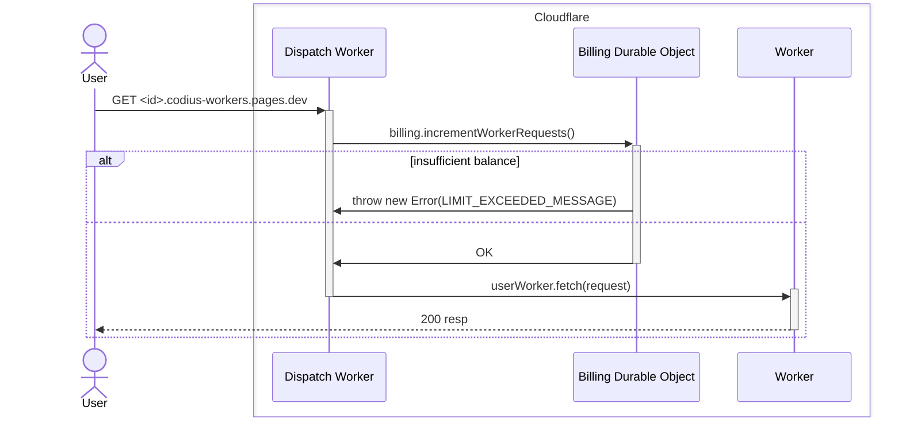
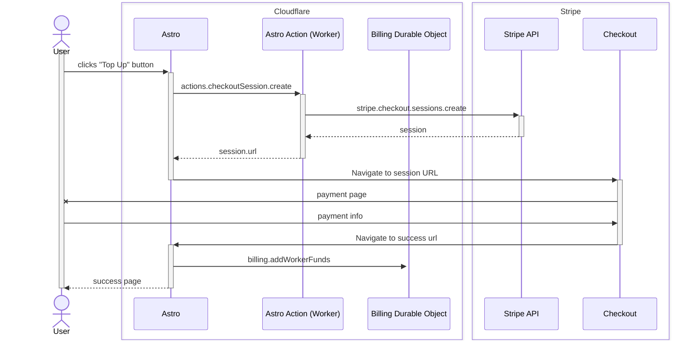

# Codius Workers

Attested hosting for [Cloudflare Workers](https://developers.cloudflare.com/workers/).

## :jigsaw: Packages

- [`codius-astro`](./packages/codius-astro) - [Astro](https://astro.build/) site for managing  workers
- [`dispatch-worker`](./packages/dispatch-worker) - [Workers for Platforms](https://developers.cloudflare.com/cloudflare-for-platforms/workers-for-platforms/)[^1] [dynamic dispatch worker](https://developers.cloudflare.com/cloudflare-for-platforms/workers-for-platforms/reference/how-workers-for-platforms-works/#dynamic-dispatch-worker)
- [`billing-durable-object`](./packages/billing-durable-object) - [Durable Object](https://developers.cloudflare.com/durable-objects/) for worker billing

[^1]: Workers for Platforms requires a [Paid plan](https://developers.cloudflare.com/cloudflare-for-platforms/workers-for-platforms/platform/pricing/).

## :wrench: Setup

### Install dependencies

```bash
pnpm install
```

## Flows

### Worker deployment



### Worker request



### Worker billing

