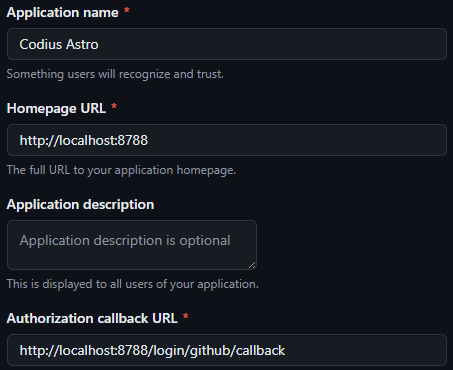

# Codius Astro

## 🚀 Project Structure

Inside of your Astro project, you'll see the following folders and files:

```text
/
├── public/
│   └── favicon.svg
├── src/
│   ├── components/
│   │   └── GitHubAuth.astro
│   ├── layouts/
│   │   └── Layout.astro
│   └── pages/
│       └── index.astro
└── package.json
```

Astro looks for `.astro` or `.md` files in the `src/pages/` directory. Each page is exposed as a route based on its file name.

There's nothing special about `src/components/`, but that's where we like to put any Astro/React/Vue/Svelte/Preact components.

Any static assets, like images, can be placed in the `public/` directory.

## :puzzle: Components

### Cloudflare Pages

- [Astro Framework](https://developers.cloudflare.com/pages/framework-guides/deploy-an-astro-site)
- [`@astrojs/cloudflare`](https://docs.astro.build/en/guides/integrations-guide/cloudflare/) adapter

### [Astro Actions](https://docs.astro.build/en/reference/configuration-reference/#experimentalactions)

- [Actions + Cloudflare](https://github.com/withastro/astro/issues/11005)

## :wrench: Setup

### Setup Cloudflare D1 Database

```bash
pnpm dlx wrangler d1 create <your-d1-db-name>
pnpm dlx wrangler d1 migrations apply <your-d1-db-name> --local
```

### Environment Variables

```bash
cp .example.dev.vars .dev.vars
```

For [`AUTH_SECRET`](https://github.com/nowaythatworked/auth-astro?tab=readme-ov-file#setup-environment-variables) in `.dev.vars`:

>Generate an auth secret by running `openssl rand -hex 32` in a local terminal or by visiting [generate-secret.vercel.app](https://generate-secret.vercel.app/32), copy the string, then set it as the `AUTH_SECRET` environment variable describe below.

For `DB`, use the name of the D1 database you created.

For `GITHUB_APP_NAME`, `GITHUB_CLIENT_ID` and `GITHUB_CLIENT_SECRET` in `.dev.vars`, you'll need to [create a GitHub OAuth App](https://authjs.dev/guides/configuring-github#creating-an-oauth-app-in-github) with:



> **Note:** Use `127.0.0.1:8788` if running with `pnpm run dev` instead of `pnpm run preview`

## 🧞 Commands

All commands are run from the root of the project, from a terminal:

| Command                   | Action                                           |
| :------------------------ | :----------------------------------------------- |
| `pnpm install`             | Installs dependencies                            |
| `pnpm run dev`             | Starts local dev server at `localhost:8788`      |
| `pnpm run build`           | Build your production site to `./dist/`          |
| `pnpm run preview`         | Preview your build locally, before deploying     |
| `pnpm run astro ...`       | Run CLI commands like `astro add`, `astro check` |
| `pnpm run astro -- --help` | Get help using the Astro CLI                     |

## 👀 Want to learn more?

Feel free to check [our documentation](https://docs.astro.build) or jump into our [Discord server](https://astro.build/chat).
