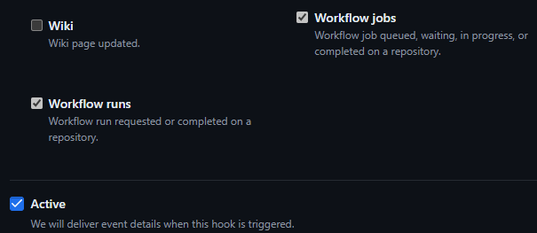

# Codius Astro

## :jigsaw: Components

### Cloudflare Pages

- [Astro Framework](https://developers.cloudflare.com/pages/framework-guides/deploy-an-astro-site)
- [`@astrojs/cloudflare`](https://docs.astro.build/en/guides/integrations-guide/cloudflare/) adapter

### [Astro Actions](https://docs.astro.build/en/reference/configuration-reference/#experimentalactions)

- [Actions + Cloudflare](https://github.com/withastro/astro/issues/11005)

## :wrench: Setup

- [Cloudflare account](#cloudflare-account)
- [D1 Database](#d1-database)
- [GitHub OAuth App](#github-oauth-app)
- [GitHub Access Token](#github-access-token)
- [GitHub Webhook](#github-webhook)
- [Stripe](#stripe)
- [Environment Variables](#environment-variables)
- [Secrets](#secrets)

### Cloudflare Account

Create a [Cloudflare account](https://www.cloudflare.com/).

You will need a paid plan and enable [Workers for Platforms](https://developers.cloudflare.com/cloudflare-for-platforms/workers-for-platforms/platform/pricing/)[^1].

Create a [Cloudflare API Token](https://developers.cloudflare.com/api/tokens/create) with permission to Edit Workers Scripts.

Add [`CLOUDFLARE_ACCOUNT_ID`](#cloudflare_account_id) and [`CLOUDFLARE_API_TOKEN`](#cloudflare_api_token) as project [secrets](#secrets).

[^1]:
    Cloudflare [`wrangler`](https://developers.cloudflare.com/workers/wrangler/) cli currently doesn't support local development for Workers for Platforms.
    See https://github.com/cloudflare/workers-sdk/pull/5622

### D1 Database

Create a [Cloudflare D1 Database](https://developers.cloudflare.com/d1/) for managing user and worker data.

From monorepo root:

```bash
pnpm --filter codius-astro d1 create <your-d1-db-name>
```

Add the D1 `database_name` and `database_id` to `[[wrangler.env]]` in [wrangler.toml](./wrangler.toml) in the following sections:

- `[[d1_databases]]` (for local development)
- `[[env.preview.d1_databases]]` (for preview deployments)
- `[[env.production.d1_databases]]` (for production deployments)

See Workers [Environments](https://developers.cloudflare.com/workers/wrangler/environments/) and Pages [Branch deployment controls](https://developers.cloudflare.com/pages/configuration/branch-build-controls/) documentation for more information about managing production and preview environments for your Cloudflare Pages project.

Apply migrations to your database:

```
pnpm --filter codius-astro drizzle-kit generate
pnpm --filter codius-astro d1 migrations apply <your-d1-db-name> --local
pnpm --filter codius-astro d1 migrations apply <your-d1-db-name> --remote
```

> **Note:** Rollback local migrations by deleting the state files with the following command:
>
> ```bash
> rm packages/codius-astro/.wrangler/state/v3/d1/miniflare-D1DatabaseObject/*
> ```

### GitHub OAuth App

You'll need to [create a GitHub OAuth App](https://authjs.dev/guides/configuring-github#creating-an-oauth-app-in-github) to allow users to login with GitHub.

`Authorization callback URL` should be either:

- `http://localhost:8788/login/github/callback` for local development or
- `https://<your-pages-domain>/login/github/callback`

Example:


> **Note:** Use `127.0.0.1:8788` if running with `pnpm run dev` instead of `pnpm run preview`

Add [`GITHUB_APP_NAME`](#github_app_name) and [`GITHUB_CLIENT_ID`](#github_client_id) as [environment variables](#environment-variables) with the values from the GitHub OAuth App.

Add [`GITHUB_CLIENT_SECRET`](#github_client_secret) as a project [secret](#secrets) with the value from the GitHub OAuth App.

### GitHub Access Token

You'll need to [create a GitHub Access Token](https://docs.github.com/en/authentication/keeping-your-account-and-data-secure/managing-your-personal-access-tokens#creating-a-fine-grained-personal-access-token) with Read and Write access to Actions in order for codius-astro to deploy workers via its [GitHub Actions workflow](./.github/workflows/deploy-worker.yml).


Add [`GITHUB_ACCESS_TOKEN`](#github_access_token) as a project secret with the value from the GitHub Access Token.

### GitHub Webhook

You'll need to [create a GitHub repository webhook](https://docs.github.com/en/webhooks/using-webhooks/creating-webhooks#creating-a-repository-webhook) to handle Workflow jobs and Workflows runs events.

For `Payload URL`, use either:

- `https://smee.io/<your-smee-path>` for local development with [Smee.io](https://smee.io/) or
- `https://<your-pages-domain>/webhooks/github/workflow-job`

Generate a `Secret` for the webhook and add [`GITHUB_WEBHOOK_SECRET`](#github_webhook_secret) as a project [secret](#secrets).

Example:




### Stripe

You'll need to [create a Stripe account](https://stripe.com/docs/development/quickstart#api-keys) and get your Stripe Secret Key.

Create a Stripe Product and Price for topping up worker balances.

The Price should be of type [`Customer chooses price`](https://docs.stripe.com/payments/checkout/pay-what-you-want).

Add [`STRIPE_SECRET_KEY`](#stripe_secret_key) and [`STRIPE_TOPUP_PRICE_ID`](#stripe_topup_price_id) as project [secrets](#secrets) with the values from Stripe.

### Environment Variables

Environment variables are managed in [wrangler.toml](./wrangler.toml).

- [CF_DISPATCH_NAMESPACE](#cf_dispatch_namespace)
- [DISPATCH_WORKER_HOSTNAME](#dispatch_worker_hostname)
- [GITHUB_APP_NAME](#github_app_name)
- [GITHUB_CLIENT_ID](#github_client_id)

#### `CF_DISPATCH_NAMESPACE`

The namespace of the [dispatch-worker](../dispatch-worker) deployed to Cloudflare Workers.

#### `DISPATCH_WORKER_HOSTNAME`

The hostname of the [dispatch-worker](../dispatch-worker) deployed to Cloudflare Workers.

#### `GITHUB_APP_NAME`

The name of the [GitHub OAuth App](#github-oauth-app).

#### `GITHUB_CLIENT_ID`

The Client ID from the [GitHub OAuth App](#github-oauth-app).

### Secrets

Secrets are managed in `.dev.vars` for local development.

From `packages/codius-astro`:

```bash
cp .example.dev.vars .dev.vars
```

Add the secrets from your `.dev.vars` to your Cloudflare Pages project as [encrypted secrets](https://developers.cloudflare.com/pages/functions/bindings/#secrets).

- [`CLOUDFLARE_ACCOUNT_ID`](#cloudflare_account_id)
- [`CLOUDFLARE_API_TOKEN`](#cloudflare_api_token)
- [`GITHUB_CLIENT_SECRET`](#github_client_secret)
- [`GITHUB_ACCESS_TOKEN`](#github_access_token)
- [`GITHUB_WEBHOOK_SECRET`](#github_webhook_secret)
- [`STRIPE_SECRET_KEY`](#stripe_secret_key)
- [`STRIPE_TOPUP_PRICE_ID`](#stripe_topup_price_id)

#### `CLOUDFLARE_ACCOUNT_ID`

Your Cloudflare Account ID.

#### `CLOUDFLARE_API_TOKEN`

Your Cloudflare API Token.

#### `GITHUB_CLIENT_SECRET`

The Client Secret from the [GitHub OAuth App](#github-oauth-app).

#### `GITHUB_ACCESS_TOKEN`

The [GitHub Access Token](#github-access-token) for deploying workers.

#### `GITHUB_WEBHOOK_SECRET`

The secret for the [GitHub repository webhook](#github-webhook).

#### `STRIPE_SECRET_KEY`

Your Stripe Secret Key.

#### `STRIPE_TOPUP_PRICE_ID`

The Stripe Price ID for topping up your account.

## :rocket: Deploy

You can deploy the codius-astro site to Cloudflare Pages via either [direct upload](https://developers.cloudflare.com/pages/get-started/direct-upload/) or [git integration](https://developers.cloudflare.com/pages/get-started/git-integration/).

For direct upload, you can use the following command from the monorepo root:

```bash
pnpm --filter codius-astro pages deploy
```

## 🧞 Commands

All commands are run from the root of the monorepo, from a terminal:

| Command                                          | Action                                                       |
| :----------------------------------------------- | :----------------------------------------------------------- |
| `pnpm install`                                   | Installs dependencies                                        |
| `pnpm --filter codius-astro run dev`             | Starts local dev server at `localhost:8788`                  |
| `pnpm --filter codius-astro run build`           | Build your production site to `./dist/`                      |
| `pnpm --filter codius-astro run preview`         | Preview your build locally, before deploying                 |
| `pnpm --filter codius-astro run astro ...`       | Run CLI commands like `astro add`, `astro check`             |
| `pnpm --filter codius-astro run astro -- --help` | Get help using the Astro CLI                                 |
| `pnpm --filter codius-astro run smee`            | Start a local webhook proxy with [Smee.io](https://smee.io/) |
